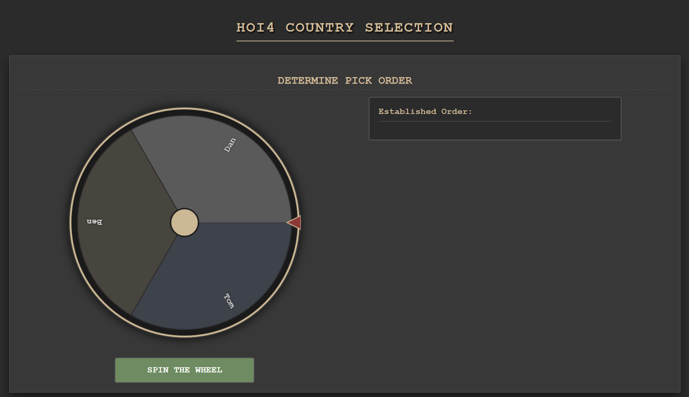
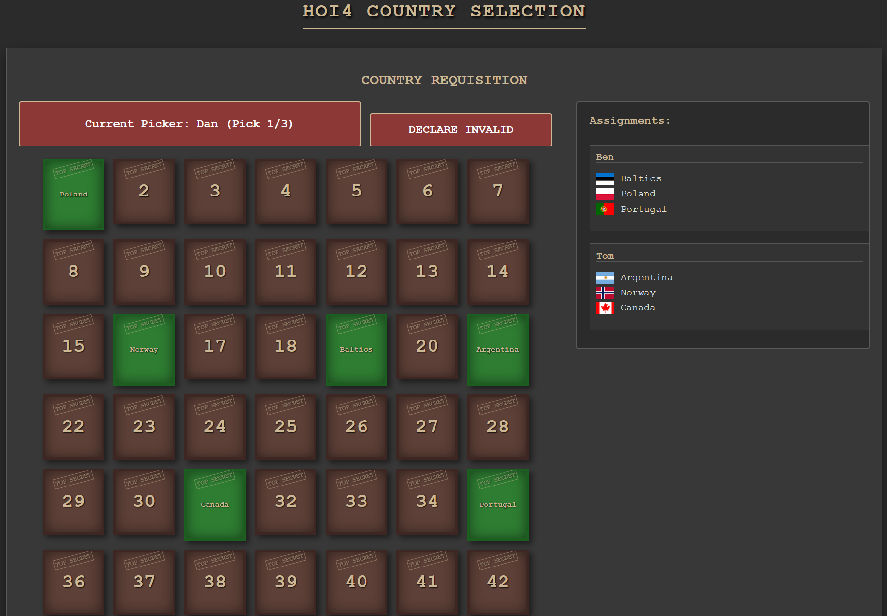
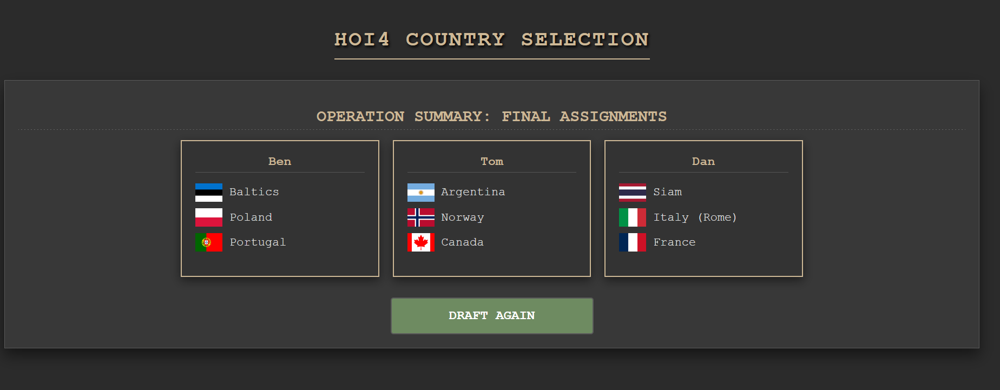

# HOI4 Multiplayer Country Picker

A fully interactive, military-themed web application designed for Hearts of Iron IV multiplayer groups to manage player sign-ups, determine draft order, and randomly assign countries via a "Mystery Crate" system.

## Features

- **Mission Briefing (Setup)**:
  - Add/Remove Recruit (Player) names.
  - Customize the pool of "Strategic Targets" (Countries) with ISO flags.
  - Set the number of picks per player.

- **Determine Pick Order**:
  - Physics-based spinning wheel to determine the draft sequence.
  - Automatic handling of the final two players.

- **Country Requisition (Drafting)**:
  - **Mystery Crates**: Players pick numbered "Top Secret" crates instead of a simple list.
  - **Sequential Drafting**: Supports "Snake" or sequential pick logic (e.g., Player A picks 3 times, then Player B).
  - **Veto System**: "Declare Invalid" button allows immediate rollback of an invalid pick (e.g., incompatible faction) while burning the crate.
  - **Audio Effects**: Immersive sounds for wheel spins and crate openings.

- **Operation Summary**:
  - Final dashboard showing all assigned countries per player.
  - "Draft Again" capability that recycles the country pool for the next round.

## Screenshots

### 1. Setup Phase
Manage your recruits and country pool.

### 2. Pick Order Wheel
Determine who gets first pick with a physics-based wheel.

### 3. Mystery Crate Drafting
Select numbered crates to reveal your assigned country.

### 4. Final Assignments
Review the final roster.

## Installation & Usage

1. Clone the repository.
2. Open `index.html` in any modern web browser.
3. No build steps or server required (Vanilla JS/HTML/CSS).

## Credits

- Built for HOI4 Multiplayer communities.
- Uses [flagcdn.com](https://flagcdn.com) for country flags.
